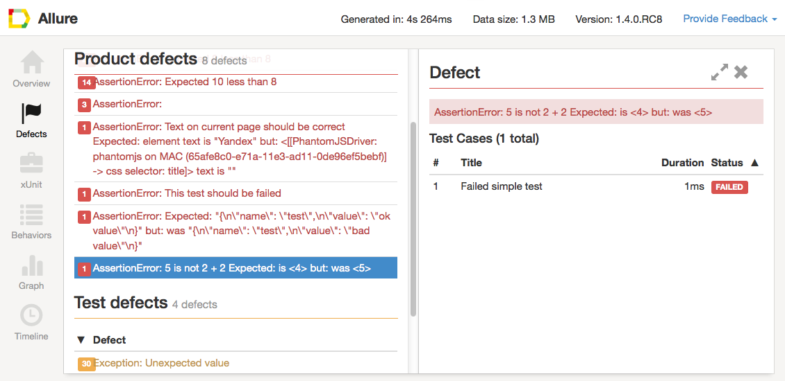
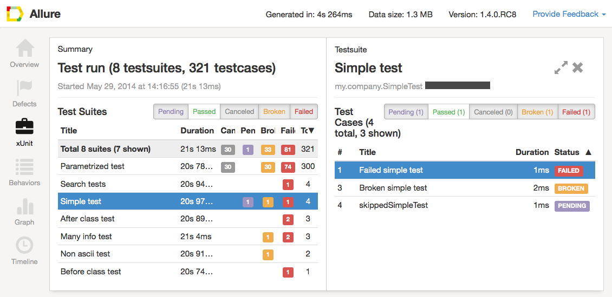
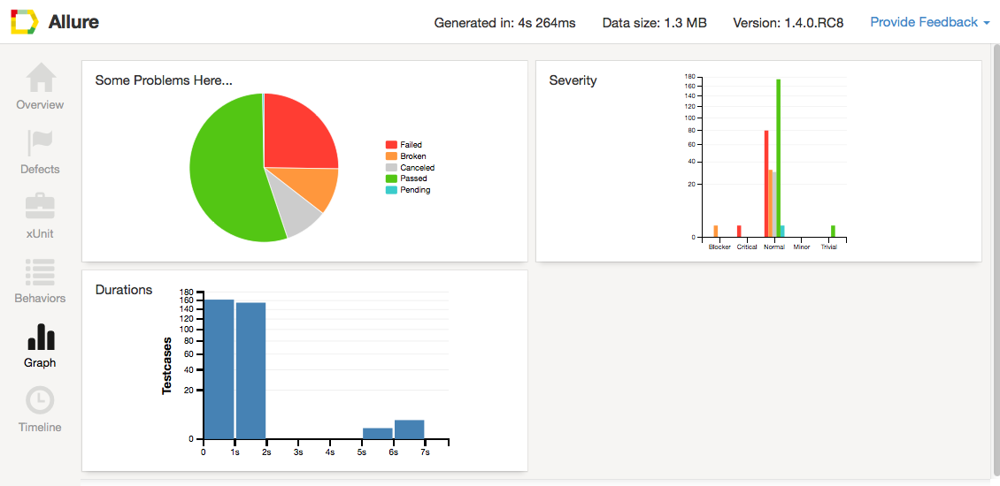

This extension allows you to generate and view Allure test reports right from the Visual Studio Team Services interface.

## Why to use Allure

There are lots of cool testing frameworks for different programming languages. Unfortunately only few of them can provide good representation of test execution output. Allure is an open-source framework designed to create test execution reports clear to everyone in the team.

## How it works

Allure is based on standart xUnit results output but adds some supplementary data. Any report is generated in two steps. During test execution (first step) a small library called adapter attached to testing framework saves information about executed tests to XML files. We already provide adapters for popular Java, PHP, Ruby, Python, Scala and C# test frameworks.

During report generation (second step) XML files are transformed to HTML report. This can be done with command line tool, plugin for CI or build tool. See examples and documentation for more details.

## How it looks like

Overview page shows overall test execution statistics with a list of test parameters. Right section contains top defects grouped by defect message.

Defects page gives detailed list of defects revealed during test execution. We distinguish product defects which correspond to failed tests and test defects - correspond to broken tests.

xUnit page shows statistics in terms of xUnit. You can view test statistics for each test suite and detailed information about every test case.

Behaviors page groups test data in terms of BDD. You can easily view which features and stories have problems.

Graphs help you to visually estimate test results.

Timeline page shows in which moment of time every test case was executed and how long it was running.

